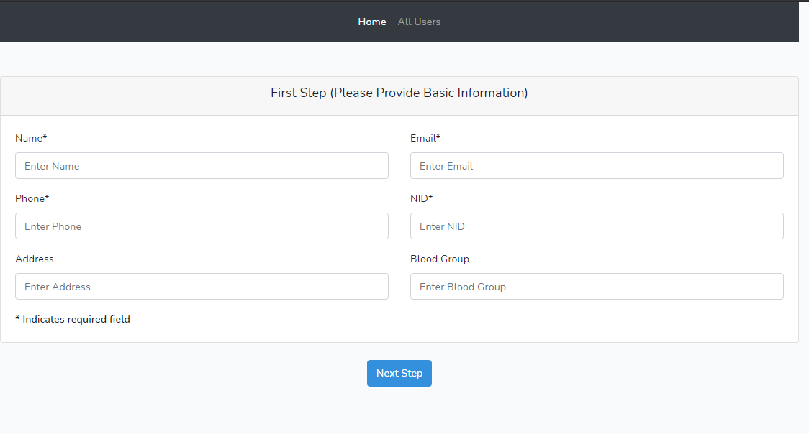
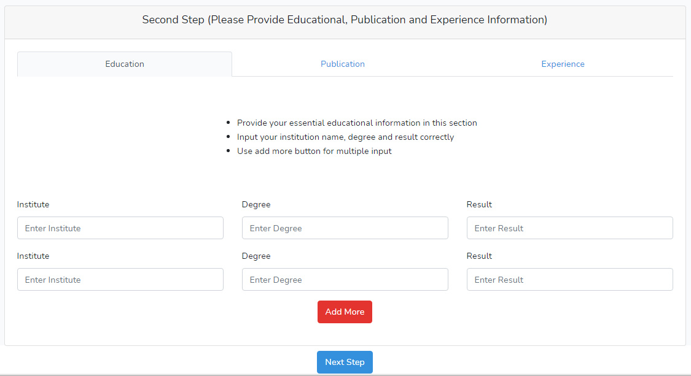
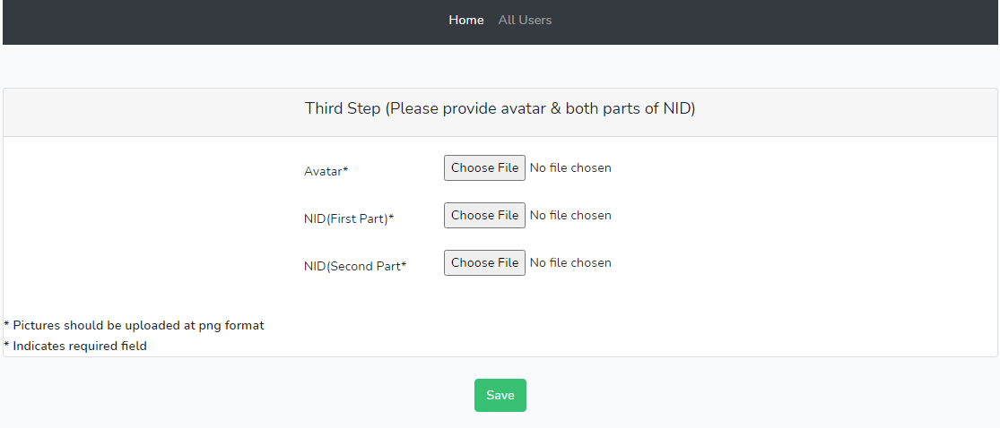

## About this project

Multi-step Lecturer registration module using Vue component.

## File structure

I have mainly used 3 components in this project --

* FirstComponent.vue : This component is containing Step1 (Applicant's basic information) of the form.
* SecondComponent.vue : This component is containing Step2 (Applicant's educational, publication and experience information) of the form.
* ThirdComponent.vue : This component is containing Final step (Applicant's avtar and NID) of the form.

There are also 2 additional components in this project (LayoutComponent.vue, ShowResult.vue) which I have made for creating the navbar on top and showing output. Moreover, There is a controller in this project (WizardController) which takes care about the process of storing data in the databse. I have made necessary migration files as well.

## Glimpse of this project

:)
